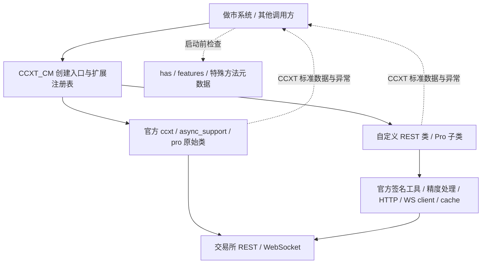

# CCXT_CM

[](https://github.com/Nova3322/CCXT_CM/actions/workflows/ci.yml)

**用官方 CCXT / CCXT Pro 的同一套接口，连接官方交易所和自行接入的交易所。**

这是独立维护的 Python 扩展库，不是 CCXT 官方发布、认证或赞助的项目。
官方功能直接依赖 `ccxt`，不 fork、不复制整个 CCXT、不修改 `site-packages`、不 monkey-patch 官方命名空间。

## 本阶段交付与边界

| 范围 | 状态 |
|---|---|
| 官方交易所 | 从已安装 CCXT 动态获取，返回原始官方类/实例，不维护固定名单 |
| 自定义交易所 | 按 sync / async REST / Pro 注册，也可从明确指定的安装包 entry point 加载 |
| 标准接口与返回 | 直接使用 CCXT 方法、参数、数据结构和异常，不增加第二套交易 DTO |
| 能力识别 | 保留 `True` / `False` / `'emulated'` / `None`，支持启动前检查 |
| 特殊接口 | `params`、官方 implicit API、明确声明的专有方法，三者各有边界 |
| 新交易所示例 | `cm_reference`：仅本机模拟协议，真实 HTTP/WS 收发测试，不是真实交易所 |
| Antarctic | 参考代码已审计，尚未作为真实适配器发布；见[审计](docs/exchanges/antarctic.md) |
| 新版做市系统 | 已按指定源码快照分析接入点；本阶段不修改、不接入该系统 |
| 实盘验收 | 尚未执行；测试不连接真实交易所，也不使用真实密钥 |

本库只负责连接、协议转换、能力声明和返回数据。不负责报价、库存、策略、业务风控、订单账本、调度、数据库、告警或资金调拨编排。Python 是首期语言；不承诺 JavaScript/Go 等多语言转译。

## 架构



详见[架构与边界](docs/architecture.md)、[方法契约](docs/interface-contract.md)。

## 安装

需要 Python 3.11+。本次基线为 CCXT **4.5.78**；依赖范围为 `>=4.5.78,<4.6`，开发/CI 的 `uv.lock` 固定完整依赖。

首次从仓库安装（还没有发布到 PyPI）：

```bash
python -m pip install 'git+https://github.com/Nova3322/CCXT_CM.git@main'
```

`main` 会变动；部署时将 `main` 换成已验收的 commit SHA，并锁定 `ccxt==4.5.78` 或另一个已通过你方验收的版本。不要只凭版本范围认定未来版本已通过测试。

## 使用官方交易所

```python
import asyncio
from ccxt_cm import create_exchange, require_capabilities


async def main():
    exchange = create_exchange("binance", {"enableRateLimit": True}, mode="pro")
    try:
        # 这里只检查声明，不联网，也不是账户权限或市场级功能验收。
        require_capabilities(exchange, "fetchOrderBook", "watchOrderBook")
        print(type(exchange))  # 官方 ccxt.pro.binance.binance，不是包装器
        # 显式启用网络后，直接使用官方接口：
        # await exchange.load_markets()
        # book = await exchange.fetch_order_book("BTC/USDT")
        # book = await exchange.watch_order_book("BTC/USDT")
    finally:
        await exchange.close()


asyncio.run(main())
```

- `mode="sync"` → `ccxt` 同步 REST。
- `mode="async"` → `ccxt.async_support` 异步 REST。
- `mode="pro"`（默认）→ `ccxt.pro`，同时有该类的 REST 和 WS 能力。
- 所选模式缺失会抛 `ccxt.NotSupported`，不自动退回 REST；具体方法还要检查 `has`。
- 官方 Pro 已包含在官方 `ccxt` Python 包里，不另装一个名为 `ccxtpro` 的依赖。
- `config` 原样交给 CCXT：代理、timeout、options、session 等仍按官方规则工作。只做顶层字典复制，不处理凭据存储。

## 注册自行接入的交易所

```python
from ccxt_cm import Registry
from examples.reference_exchange import EXTENSION  # 仓库演示，不随 wheel 发布

registry = Registry()
registry.register(EXTENSION)
exchange = registry.create_exchange("cm_reference", mode="pro")
# 后续方法与官方一致；该演示只接受 127.0.0.1，运行见测试。
```

正式适配器放在独立 Python 包或本库新增模块中，导出 `Extension(id, rest=..., pro=...)`。
每个模式可单独缺省；不要给 REST-only 交易所虚报 Pro。详见[新增交易所规范](docs/adding-exchanges.md)。

库也提供默认注册表的 `register()` / `load_extensions()` / `create_exchange()`，多租户应用可自行持有 `Registry`。
实例、连接和缓存应按账户及环境隔离；注册表不是连接池。

## 能力和特殊接口

```python
from ccxt_cm import capability, require_capabilities, special_methods

value = capability(exchange, "watch_orders")  # 也接受 "watchOrders"
require_capabilities(exchange, "fetchBalance", "createOrder", "cancelOrder")
# 默认不接受 emulated，确实接受其语义后才显式 allow_emulated=True。
print(special_methods(exchange))
```

`has=True` 不是“所有市场、订单类型和参数都支持”。还要看 `features`、市场元数据、账户权限及该适配器文档。
现货金额与合约张数不混用，未提供的数据保留 `None`，不伪造零余额、成交或撤单成功。

## 开发与验证

在克隆出的仓库根目录运行：

```bash
uv sync --frozen
uv run ruff check .
uv run ruff format --check .
uv run pytest -q --cov=ccxt_cm --cov-report=term-missing
uv build
uv run python -m examples.inspect_exchange binance
```

默认测试禁外网。标记 `loopback` 的测试仅允许 `127.0.0.1`，在进程内启动 HTTP/WS 服务。
如执行环境禁止绑定本地端口，先运行 `uv run pytest -m 'not loopback'`；这不等同于完整集成验收。

主动进行公共只读查询的示例（不属于默认测试）：

```bash
uv run python -m examples.public_market_data binance BTC/USDT --connect
uv run python -m examples.public_market_data binance BTC/USDT --connect --watch
```

## 文档索引

- [架构与边界](docs/architecture.md)：类关系、调用链、生命周期、升级策略。
- [标准接口与数据契约](docs/interface-contract.md)：REST / WS / 能力 / 精度 / 错误。
- [新增交易所规范](docs/adding-exchanges.md)：目录、模板、发布检查表、entry point。
- [特殊接口](docs/special-apis.md)：标准参数、原始接口、专有方法。
- [WebSocket 规范](docs/websocket.md)：认证、快照、增量、断档、重连、缓存。
- [测试与验收](docs/testing.md)：离线/本地协议/真实环境的证据边界。
- [本地参考协议](docs/reference-protocol.md)：演示实现的明确范围。
- [Antarctic 审计](docs/exchanges/antarctic.md)：已发现缺陷、迁移前提。
- [market_maker_v2 接入方案](docs/market-maker-v2.md)：当前代码映射，不声称已接入。
- [来源与依赖](docs/sources.md)、[变更记录](CHANGELOG.md)、[贡献说明](CONTRIBUTING.md)。

- [第 0 课：先看懂 CCXT](docs/learning/00-ccxt-core.md)：零基础理解统一接口，并完成第一次只读实验。
- [第 1 课：Bifu 测试与生产环境](docs/learning/01-bifu-environment.md)：创建实例并防止环境、地址和凭据混用。
- [第 2 课：Bifu `load_markets`](docs/learning/02-bifu-load-markets.md)：理解交易对、精度和限额并完成只读验收。
- [第 3 课：Bifu `fetch_ticker`](docs/learning/03-bifu-fetch-ticker.md)：理解 24 小时行情、成交量和盘口边界。
- [第 4 课：Bifu 私有订单查询](docs/learning/04-bifu-private-orders.md)：区分当前挂单、历史订单、单笔订单和自己的成交记录。
- [第 5 课：Bifu 限价下单与单笔撤单](docs/learning/05-bifu-create-cancel-order.md)：理解受理回执、POST_ONLY、最终状态复查和测试环境写入保护。
- [第 6 课：Bifu 市价买单和市价卖单](docs/learning/06-bifu-market-order.md)：理解买入预算、卖出数量、IOC 和真实成交验收。
- [第 7 课：Bifu 撤销一个交易对的全部挂单](docs/learning/07-bifu-cancel-all-orders.md)：理解影响范围、受理计数和安全验收边界。
- [第 8 课：Bifu 批量下单与批量撤单](docs/learning/08-bifu-batch-orders.md)：理解同序逐笔回执、部分拒绝、批量受理与最终状态复查。
- [第 9 课：Bifu 单笔改单与批量改单](docs/learning/09-bifu-amend-orders.md)：理解原生改单、总数量、逐项受理、最终状态复查和超时安全边界。
- [第 10 课：Bifu 资金流水](docs/learning/10-bifu-fund-flows.md)：理解余额快照与流水、流入流出、CCXT Ledger 结构、分页和脱敏验收。
- [Bifu 能力与验收矩阵](docs/acceptance/bifu-capability-matrix.md)：每轮程序测试、人工验收和复审的唯一进度表。
