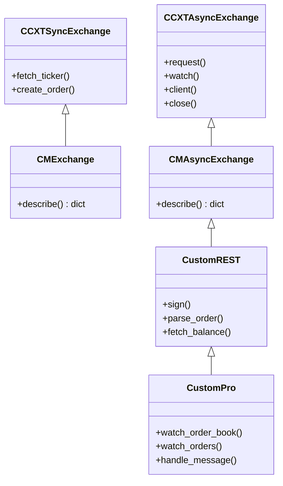
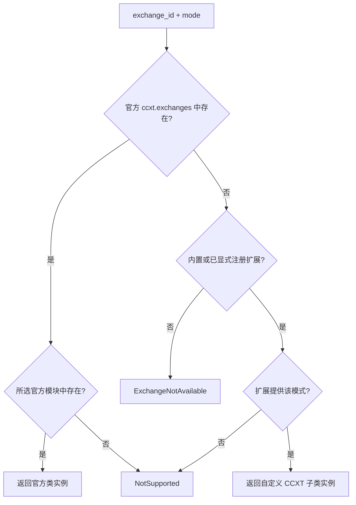
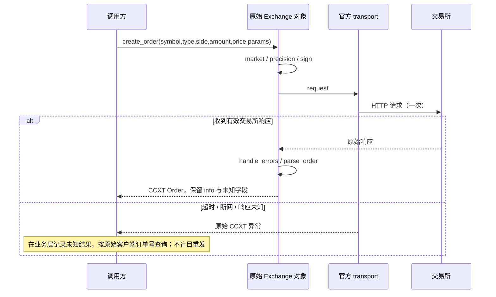

# 架构与边界

## 1. 为什么不是再做一套通用交易 SDK

统一契约已经由 CCXT 定义。再次包一层 `StandardResponse`、维护自己的 Order 类型或 HTTP 客户端，会增加字段丢失、版本漂移和错误吞没的风险。

CCXT_CM 的运行时代码只包含注册/解析、保守的自定义基类和能力辅助函数。工厂返回真实的 CCXT 对象。调用方已有的 `load_markets`、`fetch_*`、`create_*`、`cancel_*`、`watch_*` 继续使用，`params`、`info`、异常和 `close()` 也保留。

## 2. 类关系

- 新交易所继承 `ccxt_cm.AsyncExchange`：将官方通用基类里尚未由本交易所实现的默认能力全部置为 `False`。
- 已有官方交易所的特殊扩展，直接继承该官方交易所类，保留其功能，不套用“全 False”基类；注册一个不与官方冲突的新 ID。
- Pro 继承该交易所的 async REST 类，复用市场、认证工具和解析。官方 async Exchange 已提供 Pro 使用的 transport/client/cache 基础，不自造 WebSocket SDK。
- 同步实现可选。不用 `asyncio.run()` 假装同步，以免破坏已有事件循环。

## 3. 创建决策

官方优先，扩展不得覆盖官方 ID。Bifu 作为本库内置扩展，在官方 CCXT 尚未收录时由默认注册表
加载；如果未来官方收录同名交易所，导入时不再注册本库版本，工厂直接返回官方实现。其他扩展
仍需显式注册或加载，不能静默抢占官方实现。

插件仅通过 `load_extensions([明确名称])` 导入；不会扫描目录并执行未知代码。一次批量注册先在临时注册表验证，通过后替换。插件 import 本身可能有副作用，所以只加载受信任的包。

## 4. 请求与错误

CCXT_CM 不增加自动重试。新基类默认 `maxRetriesOnFailure=0`。官方实例的配置与重试行为完全由上游决定，工厂不擅自改写；生产调用方必须审查配置，尤其不要给写操作设置通用重试。

库不创建名为 `UNKNOWN` 的第二套订单状态枚举。缺失的交易所状态使用 `None`；调用方可在自己的执行账本记录 UNKNOWN。ACK 不是成交，撤单 ACK 也不一定是撤单完成。

## 5. 生命周期与隔离

- 同一个账户+环境+市场配置可以复用一个长生命周期实例，复用其市场缓存、限流器、HTTP/WS 连接。
- 不同账户或生产/测试环境使用不同实例，不共享余额、订单、杠杆等可变状态。
- async/Pro 实例只在所属事件循环使用，退出时 `await exchange.close()`。不要依赖垃圾回收关闭连接。
- 官方同步实例按官方同步客户端的资源生命周期使用；工厂没有一个假定所有模式都相同的 close 包装器。
- 注册表不是后台服务，也没有自动发现网络、自动登录、后台轮询或策略任务。
- 凭据由调用方提供，不在仓库写入 `.env`、Token 或账户资料。CCXT `verbose=True` 可能暴露敏感请求信息，真实账户默认关闭。

## 6. 维护策略

本次使用 CCXT 4.5.78，包约束 `<4.6`。`uv.lock` 锁定验收环境；CI 同时覆盖固定版本和版本范围内的最新版本。
升级 CCXT 时先跑类解析、返回结构、签名、缓存/重连和打包测试，再更新锁文件。Pro 的内部 client/cache 接口可能变动，即使仍在 4.5.x 也要测试。当前没有从 TypeScript 转译各语言的构建链。
