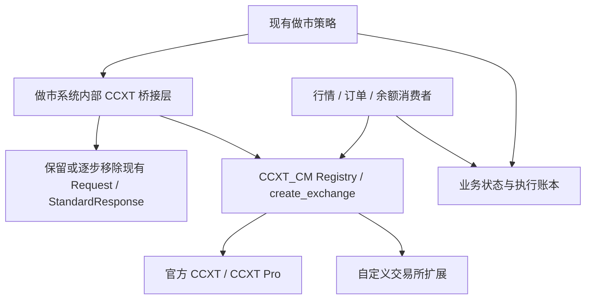

# 后续接入 market_maker_v2

## 本次检查范围

仓库：[Nanlo1/market_maker_v2](https://github.com/Nanlo1/market_maker_v2)。
读取时间：2026-09-15。检查的 HEAD：`3815026305dd3f43b2560376dd7011176af64ac1`。
该提交时间为 2025-09-01；这里只标识实际读取的源码，不推断它是否已部署。
本阶段只读取源码，没有修改、运行或迁移该系统，也没有连接其配置中心、数据库或账户。

## 当前事实

- `api/factory.py` 使用 `ExchangeAPIFactory`，支持列表固定为 lbank/allin/x100，动态导入 `api.exchanges.<name>.<market>_api`。
- `api/base/spot_api.py` 是 `BaseSpotAPI`，接受各类 Request DTO，返回 `StandardResponse`；并不是 CCXT 原生签名。
- `api/models/spot/request.py` 的 `CreateOrderRequest` 含 symbol、side、amount、price、custom_id、extra_params、order_mode 等字段。
- `api/models/spot/models.py` 定义了 `StandardOrder`、`StandardSymbolInfo` 等业务数据对象，部分数值使用 Decimal。
- `strategies/market_maker/market_maker.py:1006–1025` 名为 watch_order_books 的循环，实际调用 `market_data_client.fetch_orderbook_snapshot` 后 sleep；不等于直接使用 CCXT Pro。
- `scripts/run.py`、`scripts/pre_check.py` 已有 `ccxt.pro` 直接使用点，但这不代表全系统接口已经统一。

因此接入不是只改一行 import。迁移层应该位于做市系统仓库，不应让 CCXT_CM 反向 import 策略或 StandardResponse。

## 建议的阶段性架构

## 方法映射建议（尚未实施）

| 现有方法/字段 | CCXT 目标 | 迁移注意 |
|---|---|---|
| get_symbol_info | load_markets / market | symbol→标准格式；保留 tick size/limits，不用默认 active=True 掩盖缺失 |
| get_depth(size) | fetch_order_book(symbol, limit) | 若改用 Pro，则由消费者循环 watch_order_book，不让策略接口假扮 WS |
| get_trades(size) | fetch_trades(symbol, since, limit) | 时间单位、排序、分页 |
| get_account_balances | fetch_balance | None 与零余额区别 |
| get_trade_fee | fetch_trading_fee / fetch_trading_fees | 先检查实际能力；不全局固定一个费率 |
| create_order(request) | create_order(symbol, type, side, amount, price, params) | 明确 type；custom_id → clientOrderId，仅在交易所支持时使用 |
| extra_params | params | 保留语义且验证不支持项；不覆盖 symbol/type/side 等保留字段 |
| cancel_order(request) | cancel_order(id, symbol, params) | ACK 不当成最终状态 |
| cancel_all_orders | cancel_all_orders | 缺失则停止该能力；显式模拟需逐项结果，不能默默补全 |
| get_open_orders(page_length) | fetch_open_orders(symbol, since, limit) | 确认是否全量；页长不直接等于“全部” |
| create_batch_orders / cancel_batch_orders | create_orders / cancel_orders | 原生/模拟分开，保留每项失败与未知 |
| order_mode 等专有业务参数 | 按语义明确评审 | 不统一强塞到每家交易所；只有实际支持才映射 |
| 订单/余额实时更新 | watch_orders / watch_balance | 初始快照与流恢复竞态、事件幂等归业务层 |

保留旧 DTO 时，桥接层负责 CCXT→DTO 转换：未知数值保留 None，ID 不转浮点，时间毫秒保持一致。先有映射测试，再接到策略；CCXT_CM 仍返回原始 CCXT 结构。

## 后续验收顺序

1. 做市系统引入固定 commit 的 CCXT_CM，在应用内部增加可切换桥接层。
2. 使用本地 fixtures 回放相同输入，比较原有 DTO 与 CCXT 映射，不发真实委托。
3. 接官方已支持交易所做公共只读，再做独立账户的私有只读。
4. 对每个新交易所完成本库接入规范及能力矩阵；无 Pro 就明确采用 REST-only。
5. 先 sandbox 写入；生产写入按具体账户、市场、额度另行确认。保留未知执行结果，不自动重发。
6. 完成订单/余额对账和切换/回退验收后，再替换原有策略依赖。

以上是后续工作，不属于本次“扩展库、规范和测试”的已完成运行范围。
