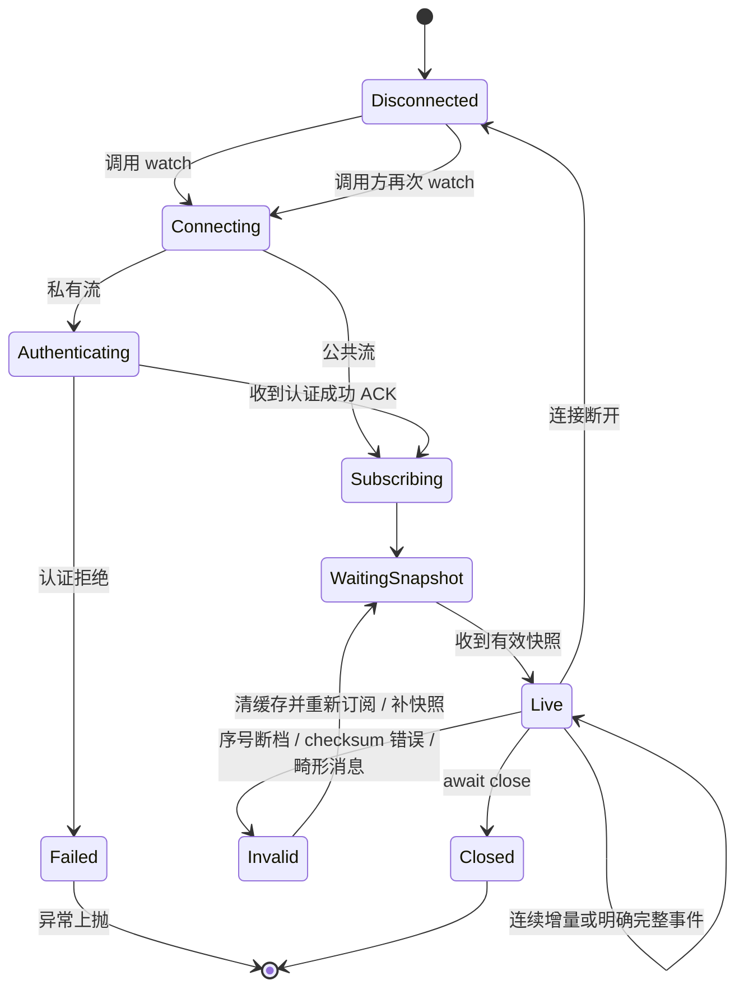

# CCXT Pro / WebSocket 接入规范

## 不只是实现一个 watch 方法

Pro 类继承本交易所 async REST 类，复用市场元数据和解析。底层连接、future、订阅去重、心跳、错误传播、缓存与 close 使用官方 primitives；协议本身的认证、序列号、checksum、快照/增量规则仍由交易所适配器负责。

## 通用要求

1. **认证**：公共与私有 channel 区分；必须等成功 ACK 再订阅私有流。失败 reject 对应等待，不只写日志。
2. **订阅键**：包含交易所原始 symbol、channel 及会影响内容的参数。重复调用不重复发送订阅。不同市场/限深/账户不共享错误缓存。
3. **OrderBook**：先有快照，后应用增量；数量 0 删除档位；买降序、卖升序；检查协议定义的 nonce/checksum/prevSeq。
4. **异常完整性**：重复/旧消息不回滚；断档时清除或标记不可用缓存并拒绝提供伪完整深度。先补快照，再恢复。协议无序号时如实声明检测能力限制。
5. **订单更新**：按 symbol + order ID 合并、去重和限长。部分更新只覆盖实际出现的字段。已收到的订单缓存不等于账户全部订单。
6. **余额更新**：区分全量与增量；缺失币种不等于零。断连后的首次增量不得当全量账户快照；需先拿快照或明确保留未知。
7. **重连**：清除旧认证/订阅和依赖连续性的缓存，重新认证和订阅，再获得基线。不得拿上个连接的深度直接应用新增量。
8. **等待与关闭**：异常/断连要让 pending future 结束；调用方取消任务不遗留发送循环；`close()` 释放 client/session/connector。
9. **有界缓存**：交易、订单和 K 线使用有界缓存。实现并测试 `since/limit/newUpdates`；不无限保存事件。
10. **来源与时间**：交易所事件时间与接收时间分开；陈旧数据不能标成当前数据。策略应设数据时效门槛，库不代替策略决定。

本地 reference 支持 JSON、认证 ACK、ticker、订单簿快照/连续增量、订单合并和余额合并。它不覆盖 protobuf、压缩、checksum、多路分片或全部 CCXT watch 方法。Antarctic 的 protobuf 协议另需按原始 schema 和真实脱敏数据验证。

## 调用方的职责

- 按 `has` 检查必需方法，明确选择 REST-only 或 Pro。
- `watch_*` 出错后决定是否继续订阅和何时停止；不把这个重连循环复用于 `create_order`。
- 维护业务 freshness、执行账本及 REST/私有流对账，未完成的写入先核查。
- 初始 `fetch_balance` / `fetch_open_orders` 与增量流之间的竞态按业务契约处理，不能先请求一次 REST 就假定没有事件丢失。
